# Projects from Digital Image class

This repository contains projects I made for the Digital Image class at Texas
A&M University. I made all using Python. You can find more about the class 
and the projects in this link:

[http://people.tamu.edu/~ergun/courses/viza654/20fall/projects/index.php](http://people.tamu.edu/~ergun/courses/viza654/20fall/projects/index.php)

## Project 1 - PPM Image format and image from a function

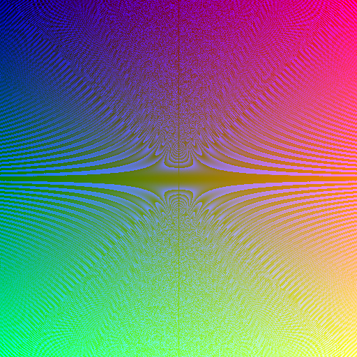

Image created from a function

## Project 2 - Image creation of half-plane, circle and polynomial. Anti-aliasing.

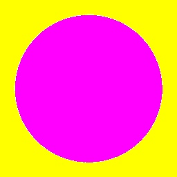

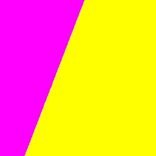

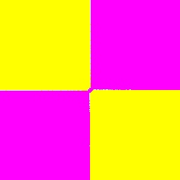

## Project 3 - Line, star and convex polygon

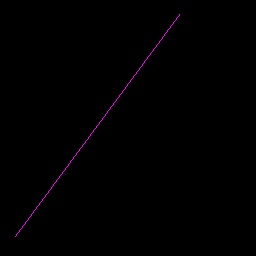

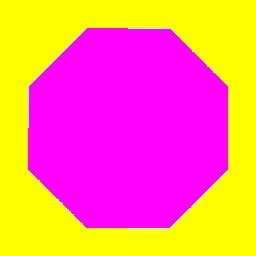

## Project 5 - Filters: Box blur, motion blur, dilation, erosion and edge

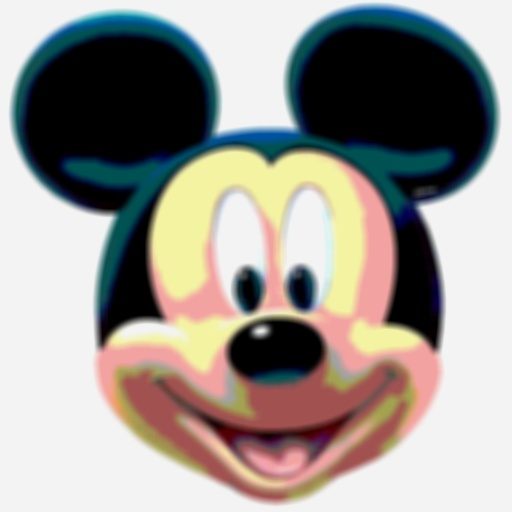

Box blur

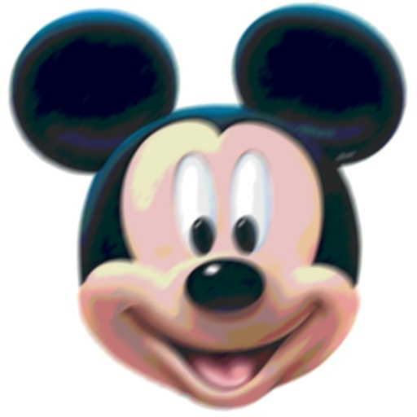

Motion blur

| 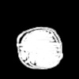  | 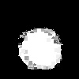  |
|:---:|:---:|
| Original | Dilated |

| 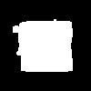  |   |
|:---:|:---:|
| Original | Eroded |

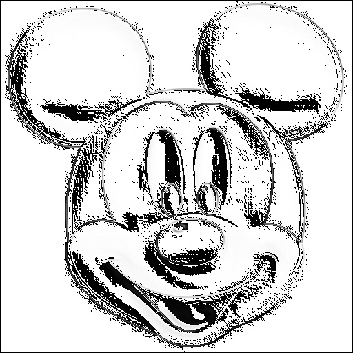

Edge

## Project 6 - Non-Stationary Filters (image instead of kernel): Motion blur and dilation

| Filter  | Input Image  | Image as Filter   | Result  |
|---|---|---|---|
| Motion Blur  | 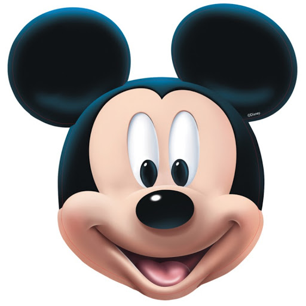 | 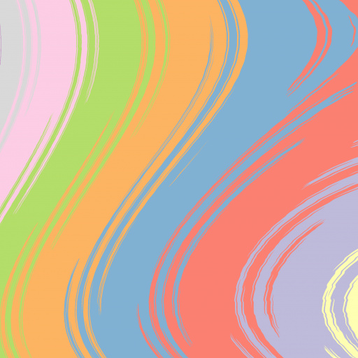 | 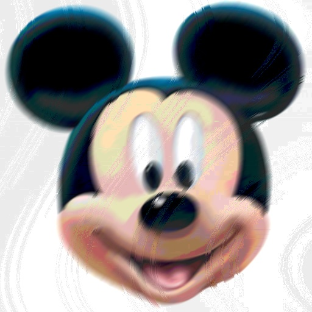  |
| Dilation  |  | 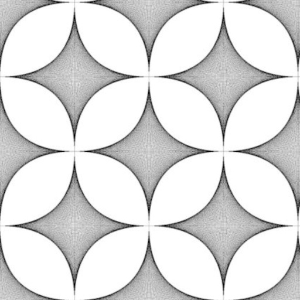 | 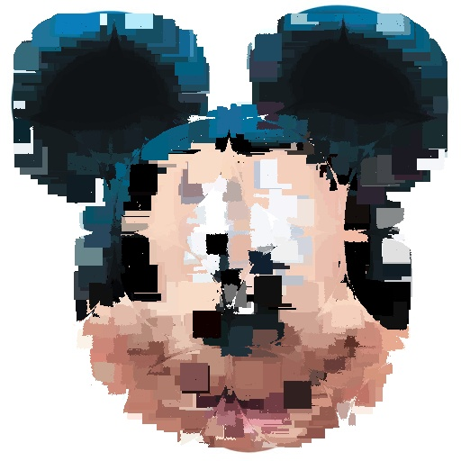 |

## Project 7 - Transformations

## Project 9 - Dithering

See [dithering.py](dithering.py)

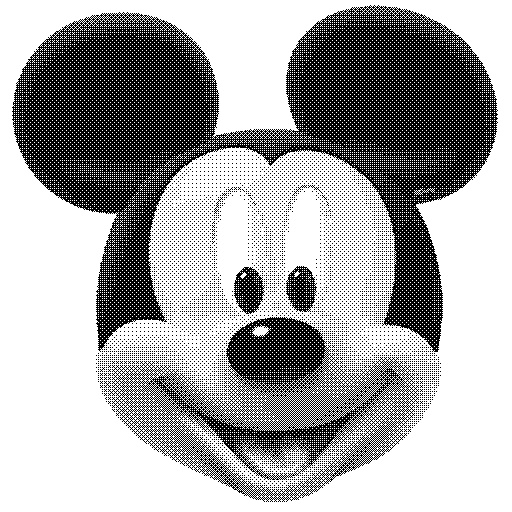

## Project 10 - Seaming and carving

See [seam_carving.py](seam_carving.py)

| Left Image | Right Image | Seaming |
|---|---|---|
| 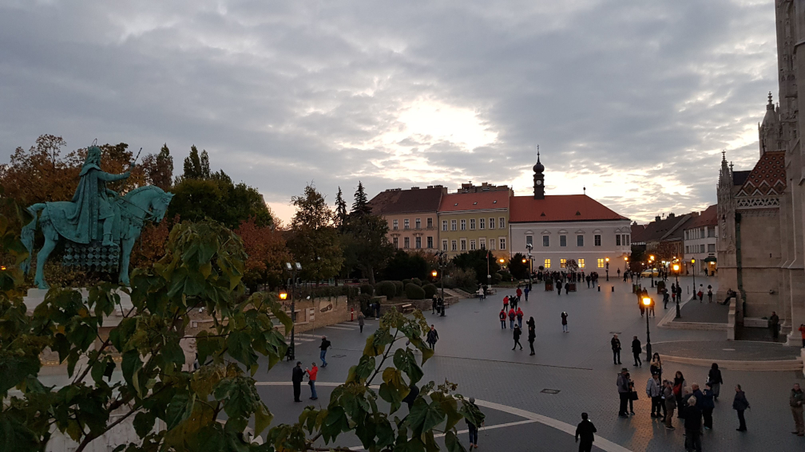 | 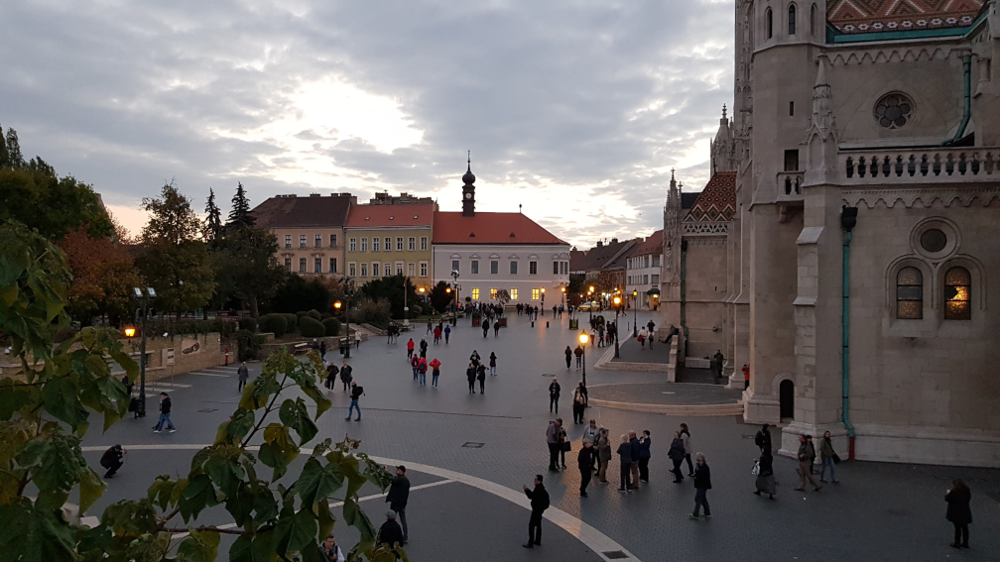 | 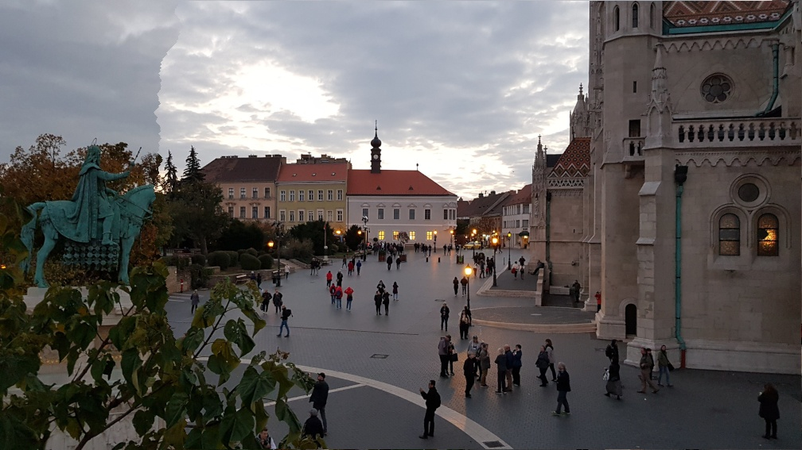 |

| Original | Carved |
|---|---|
| 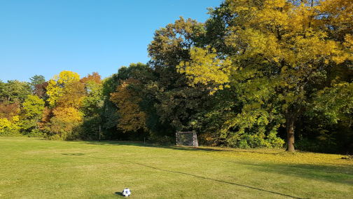 | 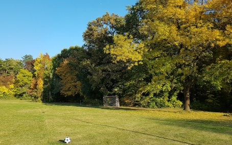 |

## Project 11 - Videos

See [video.py](video.py)

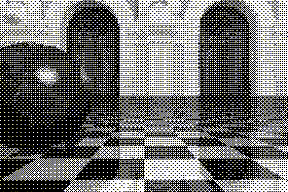

Ordered Dithering Video

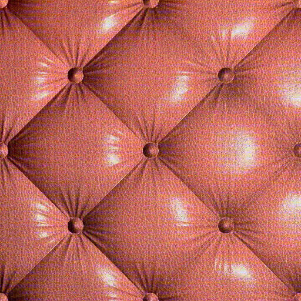

Phong Shader Video

## Dependencies

- numpy
- Pillow
- progress
